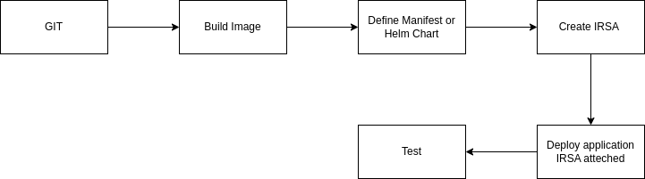

# APP

FILEPATH: app2.py

"""
This is a Python application that does XYZ.

To build and run the app, follow these steps:
1. Install Python 3.x on your machine.
2. Clone this repository to your local machine.
3. Navigate to the project directory in your terminal.
4. Install the required dependencies by running `pip install -r requirements.txt`.
5. Run the app by executing `python app2.py`.
"""

# NOTE:
For accounts created after May 31, 2023, the EC2 console only supports creating Auto Scaling groups with launch templates. Creating Auto Scaling groups with launch configurations is not recommended but still available via the CLI and API until December 31, 2023. So I cannot use the LC with my account just created from few days ago. I was changed request from LC -> launch templates. If you want keep your mind to the request please point to `app.py` that follow your request. 

# DEPLOY
Follow the steps below to deploy the app to AWS:

- Clone the repository, build the Docker image, and push it to container registry.
- Create menifest file `app.yaml` / `values.yaml` for heml to deploy the app to AWS.
- Create IRSA for EKS to access to AWS resources. (At least role: autoscaling:*)
- Deploy the app to EKS cluster by helm or kubectl with IRSA role attached.
- Test